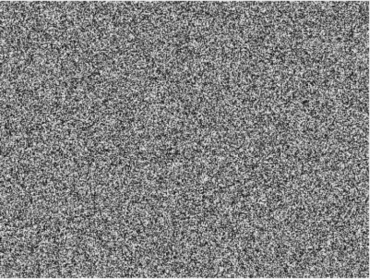
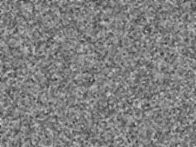
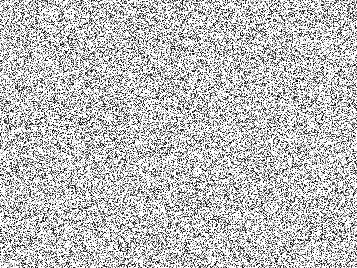
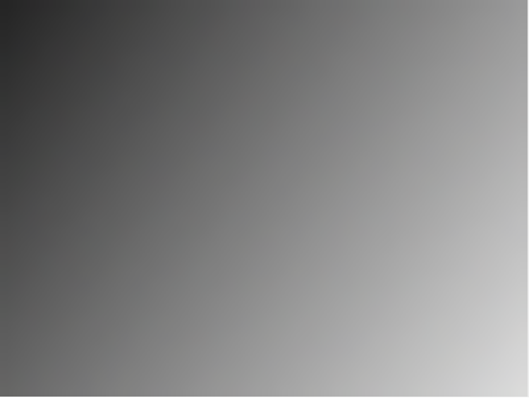
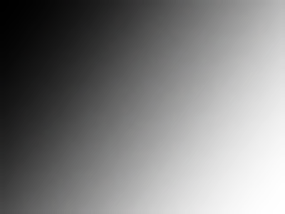
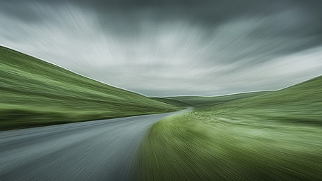
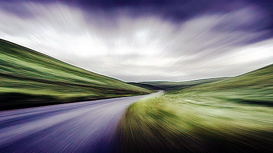
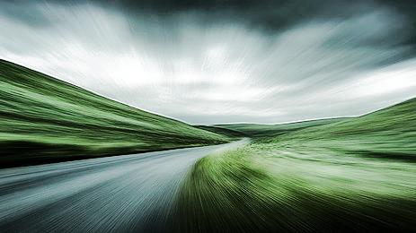
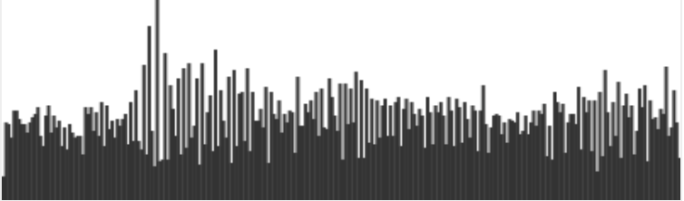
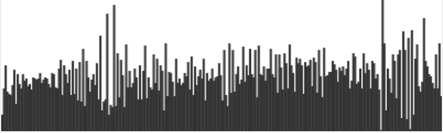

# Лабораторная работа №2 — Обработка изображений

## Цели работы

- Ознакомиться с базовыми методами цифровой обработки изображений.
- Реализовать фильтрацию, коррекцию и визуализацию изображений средствами JavaScript/TypeScript и HTML5 Canvas.
- Получить практические навыки работы с пиксельными данными и построения гистограмм.

## Описание реализованных методов

**Генерация тестовых изображений:**
- Шумное изображение — случайные значения яркости для проверки фильтров.
- Размазанное изображение — имитация эффекта блюра.
- Низкоконтрастный градиент — для теста растяжения контраста.
- Полосатая текстура — для проверки устойчивости фильтров.

**Загрузка пользовательских изображений:**
- Через стандартный элемент `<input type="file">`.
- Поддержка drag-and-drop.

**Визуализация:**
- Одновременный показ исходного и обработанного изображения.
- Гистограммы яркости строятся по формуле Rec.601 (luma).

**Медианный фильтр:**
- Подавление шумов за счёт замены значения пикселя на медиану в окрестности.
- Радиус фильтра регулируется пользователем.
- Эффективен для "соляного" шума, но может размывать детали.

**Линейное растяжение контраста:**
- Позволяет вручную задать диапазон яркости для растяжения.
- Улучшает видимость деталей на низкоконтрастных изображениях.

**Гистограммное выравнивание:**
- Коррекция распределения яркости по каналам RGB или по яркости (HLS).
- Позволяет "вытянуть" детали из тёмных/светлых областей.

**Сброс и скачивание результата:**
- Кнопка сброса возвращает исходное изображение.
- Кнопка скачивания сохраняет обработанное изображение в формате PNG.

## Интерфейс и удобство использования

- Современный минималистичный интерфейс, адаптивная верстка.
- Все элементы управления реализованы на стандартных HTML-элементах с кастомными стилями (`src/style.css`).
- Визуальная обратная связь: изменения параметров сразу отражаются на изображении и гистограмме.
- Поддержка мобильных устройств и разных размеров экрана.

## Технические детали реализации

- Вся обработка изображений реализована вручную через Canvas API, без сторонних библиотек.
- Алгоритмы фильтрации и коррекции реализованы асинхронно для плавной работы интерфейса.
- Гистограммы строятся по яркости (Rec.601 luma), что соответствует восприятию человеческого глаза.
- Код структурирован для лёгкой поддержки и расширения.

## Сравнение до и после обработки

- Медианный фильтр эффективно устраняет шум, но может размывать мелкие детали.
- Линейное растяжение контраста делает изображение более выразительным, но может усиливать шум.
- Гистограммное выравнивание позволяет улучшить видимость деталей, но иногда приводит к неестественным цветам.

## Сравнение результатов на примерах (assets)

В каталоге `assets` представлены примеры для каждого фильтра и подробное сравнение для изображения green-hills. Ниже приведена таблица с изображениями и кратким описанием результатов:

| Оригинал/Фильтр                | Оригинал/Вход | Результат | Описание |
|---------------------------------|:-------------:|:---------:|----------|
| **Медианный фильтр**            |  |  | Шум подавлен, мелкие детали могут быть размыты |
| **Растяжение контраста**        |  |  | Детали заметнее, шум усиливается |
| **Гистограммное выравнивание (RGB, размытие)** |  |  | Цвета ярче, возможны неестественные оттенки |
| **Гистограммное выравнивание (HLS, размытие)** |  |  | Цвета более натуральные, детали вытянуты мягко |

#### Сравнение для изображения green-hills

| Исходное изображение | RGB-гистограмма | HLS-гистограмма |
|:--------------------:|:---------------:|:---------------:|
|  |  |  |
|  |  |  |

**Описание:**
1. Исходное изображение.
2. После гистограммного выравнивания по каналам RGB: цвета становятся ярче, контраст выше, но иногда появляются неестественные оттенки.
3. После гистограммного выравнивания по яркости (HLS): детали вытягиваются мягче, цвета сохраняются более натуральными, артефакты минимальны.

**Вывод:**
Гистограммное выравнивание по HLS обычно даёт более естественный результат, чем по RGB, особенно после фильтрации и размытия. Медианный фильтр хорошо справляется с шумом, но может размывать детали. Растяжение контраста усиливает различия, но может сделать шум более заметным. Для оптимального результата рекомендуется комбинировать методы и визуально оценивать итоговое изображение.

## Практические рекомендации

Для удаления шумов используйте медианный фильтр с небольшим радиусом.
Для улучшения контраста — сначала растяжение, затем выравнивание гистограммы.
Не злоупотребляйте сильной коррекцией: это может привести к потере деталей или появлению артефактов.
Всегда сравнивайте результат с исходным изображением.

## Выводы

- Все методы реализованы и протестированы на различных типах изображений.
- Интерфейс обеспечивает удобную работу и быструю обратную связь.
- Реализация без сторонних библиотек гарантирует прозрачность и контроль над алгоритмами.
- Работа с Canvas API и асинхронными вычислениями позволяет создавать современные приложения для обработки изображений.
