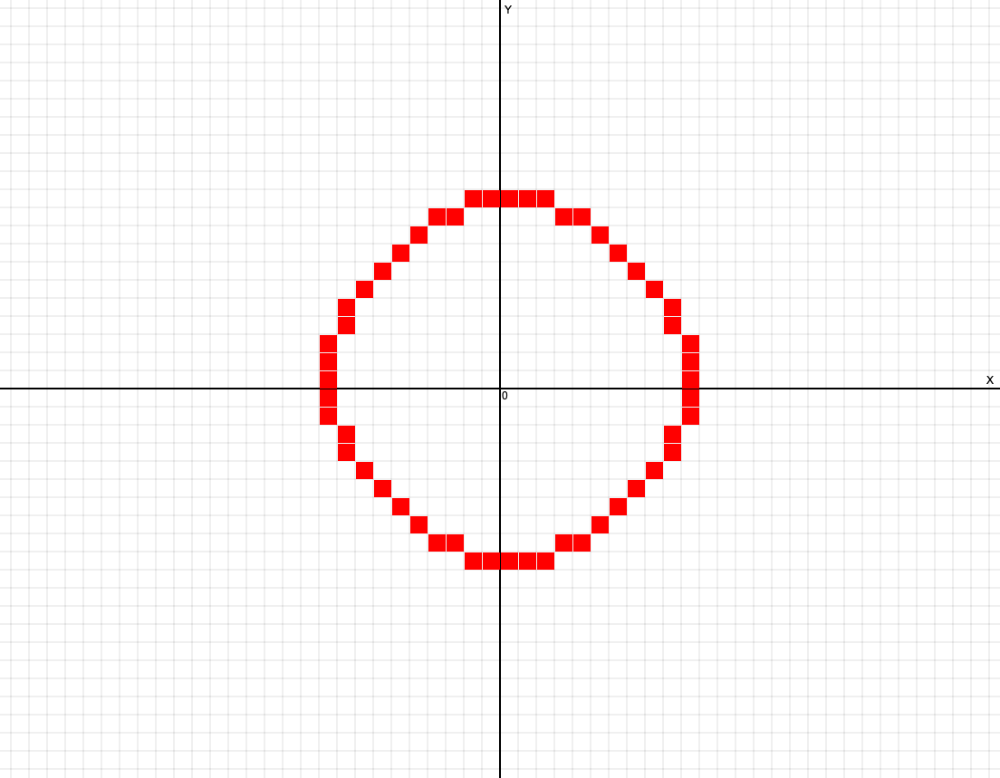
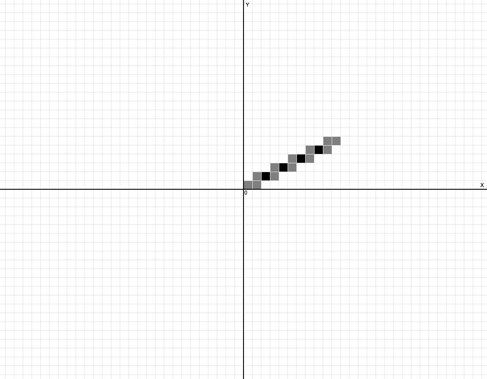
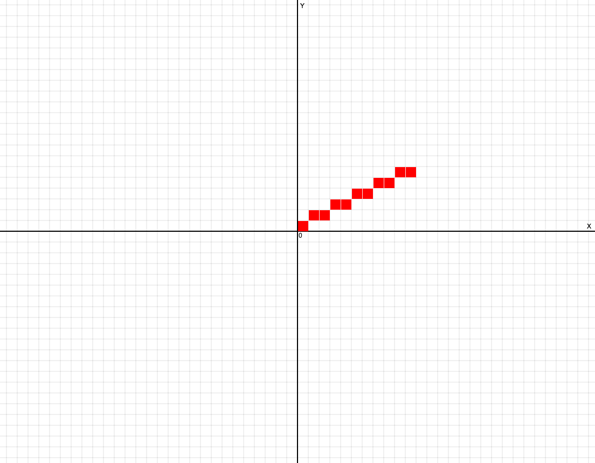

# Лабораторная работа №3 — Базовые растровые алгоритмы

## 1. Краткий отчёт о реализации

В ходе работы были реализованы и протестированы следующие алгоритмы растеризации:

*   **Пошаговый алгоритм:** Базовый подход, основанный на явном уравнении прямой $y=kx+b$.
*   **ЦДА (DDA):** Цифровой дифференциальный анализатор. Инкрементальный алгоритм, использующий вещественную арифметику.
*   **Брезенхем (линия):** Оптимизированный алгоритм, использующий исключительно целочисленную арифметику и итеративный анализ ошибки.
*   **Брезенхем (окружность):** Алгоритм построения окружности, использующий критерий минимизации ошибки и 8-кратную симметрию.
*   **Ву (Wu):** Алгоритм сглаживания (antialiasing), устраняющий эффект «ступенчатости» путём управления прозрачностью (альфа-каналом) соседних пикселей.

### 2. Временные характеристики и покрытие

Ниже приведены результаты замеров времени выполнения с включенной визуализацией.

| Алгоритм              | Время выполнения (мс)* | Закрашено пикселей |
|-----------------------|------------------------|--------------------|
| Пошаговый             | 571.000                | 11                 |
| ЦДА                   | 567.000                | 11                 |
| Брезенхем (линия)     | 581.000                | 11                 |
| Брезенхем (окружность)| 409.000                | 64                 |
| Ву                    | 1239.000               | 22                 |

> **Важное примечание по измерениям:**
> Значения времени включают искусственную задержку (latency ~50 мс) для визуализации процесса построения. Незначительная разница между Пошаговым методом, ЦДА и Брезенхемом (567–581 мс) находится в пределах погрешности таймера браузера и не отражает реальную вычислительную сложность.
>
> **Теоретическая оценка:** В реальных условиях (без задержек и на низком уровне) алгоритм **Брезенхема работает быстрее** Пошагового и ЦДА, так как он исключает ресурсоемкие операции деления и работу с вещественными числами (float), заменяя их на целочисленное сложение и битовые сдвиги.

### 3. Сравнительный анализ алгоритмов построения линий

*   **Бинарная растеризация (Пошаговый, ЦДА, Брезенхем):**
    Все три алгоритма закрасили одинаковое количество пикселей (**11**).
    Это подтверждает, что несмотря на различные вычислительные подходы (использование уравнения прямой $y=kx+b$, накопление вещественного приращения или целочисленный анализ ошибки), итоговая дискретная траектория полностью совпадает. Математически эти алгоритмы сходятся к одним и тем же координатам сетки при корректном округлении.

*   **Сглаживание (Алгоритм Ву):**
    Алгоритм закрасил **22 пикселя**, что в два раза больше результата бинарных алгоритмов.
    Это объясняется принципом работы сглаживания (antialiasing): на каждом шаге вдоль ведущей оси алгоритм рассчитывает интенсивность не для одного, а для **двух** соседних пикселей (выше и ниже идеальной линии). Сумма интенсивностей этих пар равна 100%, что визуально размывает границы и устраняет эффект «ступенчатости», характерный для первых трех алгоритмов.

### 4. Демонстрация работы (Скриншоты)

| Алгоритм | Визуализация |
| :--- | :--- |
| **Пошаговый** |  |
| **ЦДА** |  |
| **Брезенхем (линия)** |  |
| **Брезенхем (окружность)** |  |
| **Ву** |  |
| **Кастла-Питвея** |  |

### 5. Сравнительная характеристика алгоритмов

| Параметр сравнения | Пошаговый | ЦДА | Брезенхем | Ву | Кастла-Питвея |
| :--- | :--- | :--- | :--- | :--- | :--- |
| **Тип арифметики** | Вещественная (float) | Вещественная (float) | **Целочисленная (int)** | Вещественная (float) | **Целочисленная (int)** + Строковая/Структурная логика |
| **Сложность операций (в цикле)** | Высокая: Умножение (`*`), сложение, округление (`round`) | Средняя: Сложение вещественных чисел | **Минимальная:** Сложение (`+`), вычитание (`-`), битовый сдвиг (`<<`) | Высокая: Сложение, выделение дробной части, работа с цветом | **Специфическая:** Арифметически прост, но требует предварительного цикла (алгоритм Евклида) для расчета паттерна шагов. |
| **Источник вычислительной ошибки** | Ошибка округления при каждом вычислении координаты $y=kx+b$. | Накопление погрешности плавающей точки (drift) на длинных отрезках. | **Отсутствует.** Использует точный анализ ошибки (`decision parameter`) для выбора пикселя. | Отсутствует геометрически, но точность зависит от глубины цвета (битности). | **Отсутствует.** Генерирует математически идеальную целочисленную траекторию (совпадает с Брезенхемом). |
| **Эффект ступенчатости (Aliasing)** | **Присутствует.** Четкая "лесенка". | **Присутствует.** Четкая "лесенка". | **Присутствует.** Четкая "лесенка". | **Устранен.** Границы линии размываются за счет полутонов. | **Присутствует.** Четкая "лесенка". |
| **Визуальное качество** | Низкое (резкие края). | Низкое (резкие края). | Высокое (для бинарных дисплеев), геометрически идеальная "лесенка". | **Очень высокое** (линия выглядит гладкой и визуально прямой). | Высокое (для бинарных дисплеев), идентично Брезенхему. |
| **Требования к дисплею** | Монохромный (1 бит). | Монохромный (1 бит). | Монохромный (1 бит). | Поддержка градаций серого или цвета (минимум 8 бит). | Монохромный (1 бит). |
| **Энергоэффективность (для МК)** | **Низкая.** Требует программной эмуляции float или активного FPU. | **Средняя.** Зависит от наличия FPU. | **Максимальная.** Использует базовые инструкции ALU, экономит такты и батарею. | **Низкая.** Требует вычислений цвета и чтения/записи в память. | **Средняя.** Проигрывает Брезенхему из-за накладных расходов на хранение или рекурсивный расчет паттерна движения. |
| **Основная область применения** | Обучение теории, прототипирование. | Простые графические библиотеки с наличием FPU. | Встраиваемые системы, дисплеи низкого разрешения, FPGA, драйверы GPU. | Современные UI, шрифты, качественная графика, игры. | Теоретический анализ, управление шаговыми двигателями (загрузка паттернов движения), RLE-сжатие линий. |

### 6. Влияние параметров визуализации

*   **Задержка (Latency):** Используется исключительно в учебных целях для демонстрации логики работы (трассировки). В реальных графических системах задержка отсутствует.
*   **Масштаб (Zoom) и Сетка:**
    Визуализация построена на пересчете логических координат в экранные. Каждая логическая точка $(X, Y)$ отображается в центр соответствующей клетки сетки по формулам:
    $$Screen_X = Center_X + X \cdot GridSize$$
    $$Screen_Y = Center_Y - Y \cdot GridSize$$
    Знак «минус» в формуле $Y$ обусловлен тем, что в компьютерной графике ось $Y$ направлена вниз, а в декартовой системе — вверх.

### 7. Выводы

1.  **Брезенхем (линия)** является наиболее предпочтительным алгоритмом для построения примитивов, где не требуется сглаживание, благодаря использованию только целочисленной арифметики.
2.  **Алгоритм Ву** значительно улучшает визуальное восприятие линий, устраняя "лесенку", но требует больших вычислительных затрат и работы с цветом.
3.  **Брезенхем (окружность)** эффективно использует свойства симметрии, что делает его стандартом де-факто для растеризации конических сечений.
4.  Все алгоритмы реализованы корректно, что подтверждается совпадением растровой развертки (количества и позиций пикселей) на тестовых примерах.